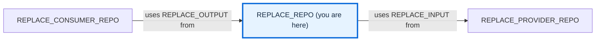

# QLI 2.0 repository skeleton

Starting files for a repository that follows the
[Required Files Checklist](https://github.com/devdocsorg/qli2-deliverables-portal/blob/8c358c87e35a25615bfb9703bc7fce7353f40be8/docs/qualcomm-developer-ecosystem/github-repositories/audits/required-files-checklist.md).
The scope is repository structure, documentation, and contribution guidance.
Choose the implementation language and build tools in the project you create.

## Get started

[Use this template](https://github.com/devdocsorg/qli2-example-repo/generate)
to create a repository from `main`, then follow the
[adoption tutorial](docs/source/user/USAGE.md) to personalise its
purpose, ownership, reporting routes, and documentation.

Prerequisites: a GitHub account with access to this repository and permission to
create a repository in the destination account. No installation or build is needed
to use the skeleton.

## Choose a branch

| Branch | Purpose and status | Use | Contributions |
| --- | --- | --- | --- |
| `main` | Active repository skeleton | Starting point for a new repository | Submit changes here |

This table lists every current branch.
[BRANCHES.md](BRANCHES.md) describes branch maintenance.

## Documentation

Open [docs/site/index.html](docs/site/index.html) directly in a browser for the
generated site. The [documentation guide](docs/README.md) explains where its
source lives and how to rebuild it.

- [Development setup](docs/source/contributing/DEVELOPMENT.md) — Clone, install the documentation tools, build, and validate locally.

- [Adoption tutorial](docs/source/user/USAGE.md) — Create a repository and make these files specific to it.
- [Configuration reference](docs/source/user/USAGE.md#configuration-reference) — Understand the skeleton's environment stub, ignore rules, owners, and issue-template fields.

## Contributing

Read [CONTRIBUTING.md](CONTRIBUTING.md) to improve the skeleton and review changes
against the checklist. Follow the [Code of Conduct](CODE_OF_CONDUCT.md) when
participating.

## Folders

- [docs/](docs/README.md) — Contains documentation source, the generated site, and the build entry point.
- [.github/](.github/) — Holds [CODEOWNERS](.github/CODEOWNERS), [issue templates](.github/ISSUE_TEMPLATE/), and the [pull request template](.github/PULL_REQUEST_TEMPLATE/pr_template.md).

## Files

- [README.md](README.md) — Introduces the skeleton, its branches, and its contents.
- [BRANCHES.md](BRANCHES.md) — Describes the purpose and maintenance of each long-lived branch.
- [CONTRIBUTING.md](CONTRIBUTING.md) — Explains contribution routing and review expectations.
- [CODE_OF_CONDUCT.md](CODE_OF_CONDUCT.md) — States participation standards and the private conduct-reporting route.
- [SECURITY.md](SECURITY.md) — Provides the private vulnerability-reporting route.
- [LICENSE](LICENSE) — Contains the skeleton's licence and retained template notices.
- [.env.example](.env.example) — Reserves the required location for documented, safe environment settings.
- [.gitignore](.gitignore) — Keeps local environment files out of version control.

## Support and licence

For questions or improvements to this skeleton,
[open an issue](https://github.com/devdocsorg/qli2-example-repo/issues/new/choose).
Report vulnerabilities through [SECURITY.md](SECURITY.md).
The skeleton is distributed under the [BSD 3-Clause licence](LICENSE).

<!-- repository-map:start -->

## Repository map

<!-- Replace the REPLACE_* fields with verified repositories, links, and connections during adoption. -->

[Full Qualcomm repository map](https://github.com/devdocsorg/qualcomm-repository-map).

<!-- repository-map:end -->
